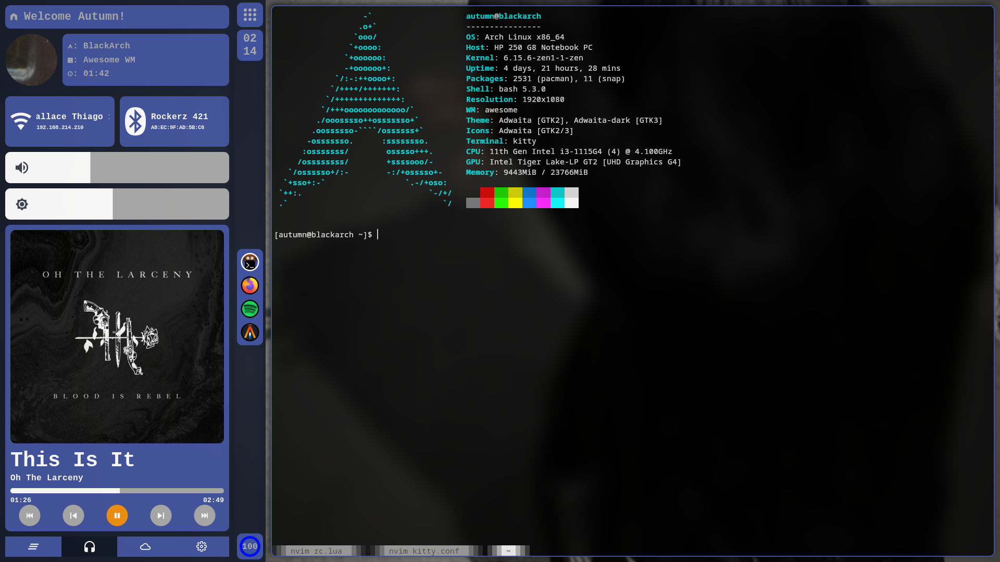
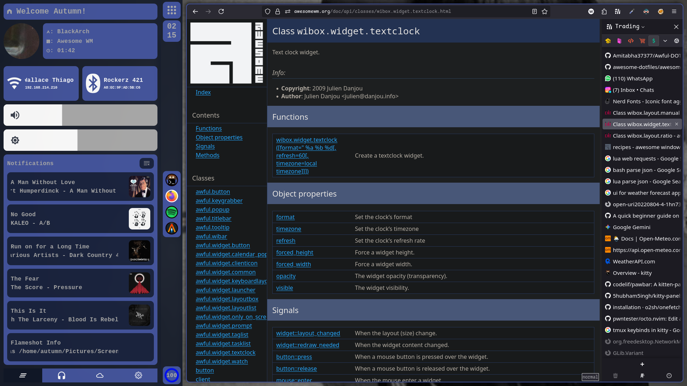
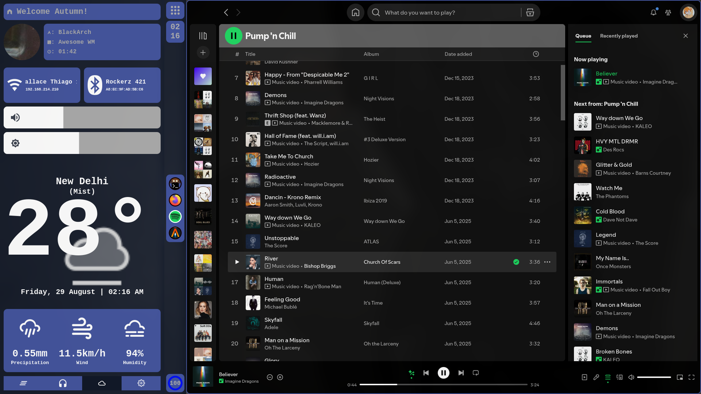

# Awesome Rice

### By [WinterSunset](https://github.com/WinterSunset)

### Featuring

#### AwesomeWM

- A sidebar (floating/fixed)
  - Menu button (clickable/bound to Mod+Shift+Cr)
  - Time widget
  - Taglist
  - Battery widget
- A menu (floating/fixed)
  - Wifi controller button
  - Bluetootn controller button
  - Volume slider
  - Brightness slider
  - A tablist
    - Notification list (scrollable)
    - Music controller
      - Play/Pause
      - Next/Previous
      - Clickable Progress Bar
    - Weather Widget
    - Bar/Menu settings

### Dependencies

- [brightnessctl](https://github.com/Hummer12007/brightnessctl)
- [playerctl](https://github.com/acrisci/playerctl)
- [inotify-tools](https://github.com/inotify-tools/inotify-tools)
- libpulse (for pactl)
- [A rapidapi key](https://rapidapi.com/)

### Screenshots

